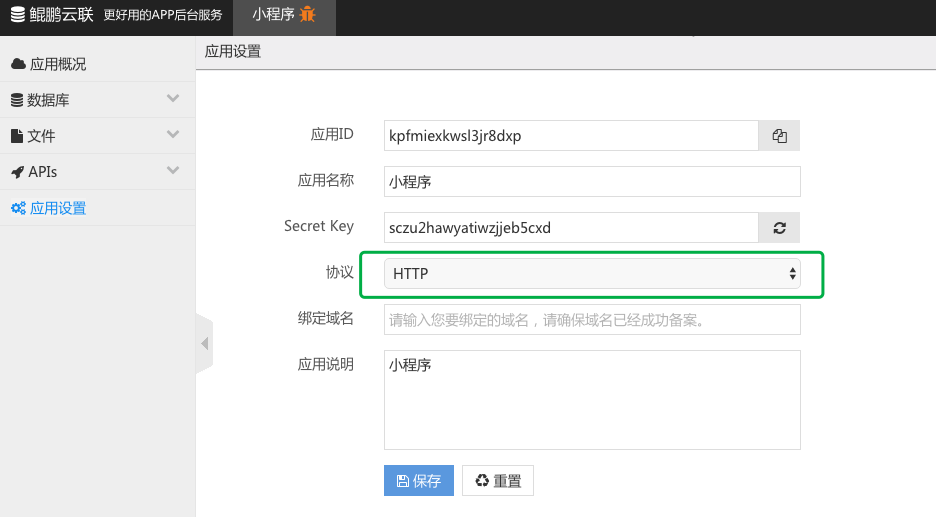

# 启用 HTTPS 协议
## 背景
HTTPS 安全协议能保证您的 API 访问传输的是经过加密的数据，从而保证系统的安全。目前微信小程序已经强制要求使用 HTTPS 协议来交换数据。
并且自2017年1月1日起，苹果强制所有 APP 满足 HTTPS，即 iOS9 推出的 App Transport Security (ATS) 特性。
## 说明
要启用 HTTPS 安全协议，您首先要有一个已通过备案的域名，下面说明了通过腾讯云平台申请免费的 SSL 证书，并开启 HTTPS 通道的 流程。
## 流程
### 一、申请免费的 SSL 证书
详细的介绍请查看 腾讯云 的说明文档，这里假定您已经是腾讯云平台会员（申请及实名认证免费），直接开始申请证书。
打开 SSL 证书管理 页面，点击下面的 “申请证书” 按钮。

点击确定后，要求输入申请证书的域名，这里不能申请顶级域名的证书，免费的嘛，所以只能为二级以上的域名申请 SSL 证书。

这里只填写“绑定域名”就可以了，然后点击 “下一步”，将会验证域名是否存在，验证通过后来到下面的画面：

您的域名是在 腾讯云 解析的，那么点击上面的“详细说明”，按步骤操作即可。这里先点击“确认申请”按钮，获取解析记录。
如果您使用的是阿里云（万网）的域名解析，将点击“确认申请”后获得的 CNAME 按照下面的说明填写正确，系统稍后会自动检查。

这边申请证书的域名是： app.sqlend.com ，在主机记录里，只需要填写申请时给出的 sxxxxxxxxxxx.app 即可，后面的 sqlend.com 域名不填，记录值（第二个框）按照给出内容的完整填写。
一般情况下，十来分钟后您就会收到证书申请成功的短消息通知。下来就是把证书绑定到鲲鹏云联的平台上，并开通 HTTPS 协议。
### 二、上传证书到平台
现在您已经可以在证书列表中看到您刚申请成功的证书了，点击下载，将证书下载到本地，并解开压缩包。

这里只需要使用 Nginx 目录下的文件，其中.crt文件即是证书内容，.key 文件为证书的私钥。
然后在鲲鹏云联平台上，选择一个应用，在应用设置的画面里，将协议从 HTTP 变更为 HTTPS。

请用文本编辑器打开 Nginx 目录下的 .crt 文件，将内容复制到右侧的 “SSL 证书”中去。

接下来再用文本编辑器打开 Nginx 目录下的 .key 文件，将内容复制到右侧的 “SSL 私钥” 中去。
同时把域名填写完，完成后就像下面这样。

最后点击保存，您的 API 访问就可以使用 HTTPS 协议了。
### 测试 API
经过以上的步骤，我们为 API 访问开启了 HTTPS 访问，下面通过一个简单的例子来测试下。
在 API 管理里新建一个 API，主要功能就是列出表中所有滑动窗显示的商品内容，如下。

点击保存并调试，来到调试画面。

现在可以看到输出了，HTTPS 协议已经正常工作了。