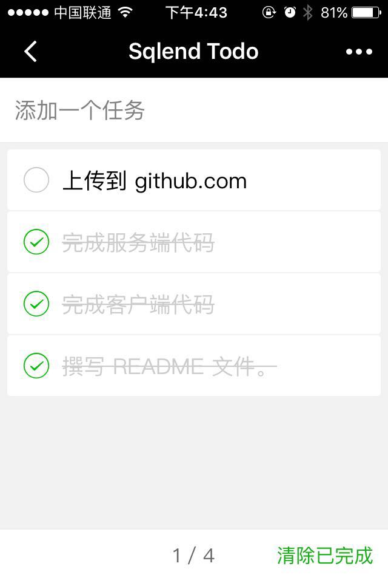

# 从一个微信小程序开始

下面我们通过实现一个 Todo List 的小程序，来说明如何利用鲲鹏云联开发一套完整 APP 程序的流程。所有代码都已经发布到 [github.com](https://github.com/timesong/sqlend_wetodo)。

## 小程序截图

## 小程序功能说明

* 获取微信用户 Openid 及相关信息，并保存到数据库
* 用户随时添加新的 Todo 事项，并立即发布到服务器
* 用户点击 Todo 事项，设定为已完成，状态立即同步到服务器
* 用户点击 Todo 事项，修改事项内容，更改立即同步到服务器
* 用户清除所有已完成的 Todo 事项，服务器端同步删除

## 准备工作

* 申请微信小程序账号，请参考 [[微信公众平台](http://mp.weixin.qq.com)] 的说明
* 下载并安装微信 Web 开发者工具
* 注册鲲鹏云联账号，并在我的账号进行充值，如果您有优惠券，请使用优惠码充值
* 新建应用，输入应用名称及功能简介即可完成应用的创建

## 新建数据表

### 创建微信用户信息表 (wx_users)
* 在数据库管理中选择新建数据表，输入表名，添加数据表字段，如下图：

### 创建 Todo List 表 (todos) 
* 在数据库管理中选择新建数据表，输入表名，添加数据表字段，如下图：

